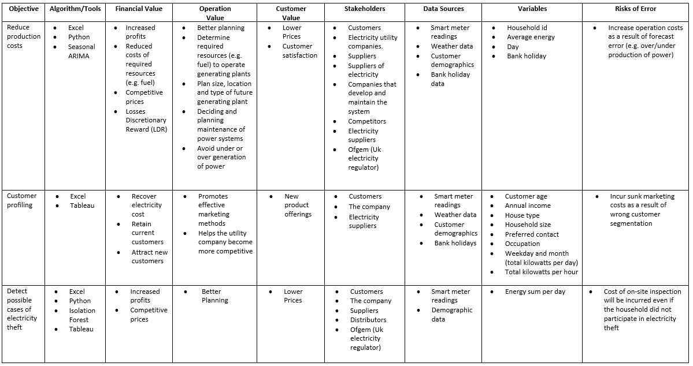
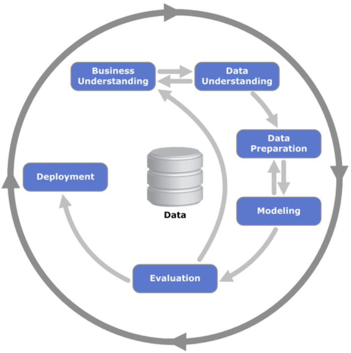

# London Smart Meters (MSc Capstone Project) :mortar_board:

## Summary ## 
### About :grey_question: ###
In this project, I led a team of 4 individuals where we analyzed electricity smart meter readings of 3,852 households in London for the year 2013. A quick overview of this project is illustrated in the image below:

### Objectives :dart: ### 
1. To help electricity utility companies reduce production costs.
2. To segment and profile customers associated with the smart meter data.
3. To identify anomalies in the data that could be associated with electricity theft.
### Business Value :moneybag: ###
• Aids with efficient scheduling of scarce resources.

• Helps with the creating of effective marketing methods.

• Helps attract new customers and retain current customers.

• Helps with the creation of new products and services.

• Helps increase profits as losses associated with electricity theft will be reduced.

• Helps create competitive prices.

### Tools Used :hammer: ###
• Python • Jupyter Notebook • Pandas • NumPy • Matplotlib • Seaborn • scikit-learn • Microsoft Excel

### Results Overview :chart_with_upwards_trend: ###

#### Objective 1 ####
• The Seasonal ARIMA model produced an MAPE of 3.34 which indicated that the model has a 96.66 accuracy at predicting the next few observations.

• Furthermore, the MAE (0.1) and RMSE (0.57) were both low. RMSE of 0.57 indicated an approximate 0.57-kilowatt error per day.

#### Objective 2 ####
• Customers in the “Lavish Lifestyles” segment are the wealthiest customer group. They are aged 50-75+ and earn an annual income of £60k-£100,000+ per year. The majority of these customers live in detached houses and they prefer to be contacted by email or mail. Their peak electricity demand time during winter is 5pm-10pm.

• Customers in the “City Sophisticates” segment are also a top income earning customers. They are aged 25-34+ and earn an annual income of £60k-£100,000 per year. The majority of these customers live in a flat or maisonette. They prefer to be contacted by mail. Their peak electricity demand time during winter is 5pm-11pm.

• Customers in the “Successful Suburbs” segment are aged 50-74 and earn an annual income of £40k-£100,000 per year. The majority of these customers live in detached houses and they prefer to be contacted by mail. Their peak electricity demand time during winter is 5pm-10pm.

• Customers in the “Student Life” segment are aged 19-24 and earn an annual income of £0k-£40,000+ per year. The majority of these customers live in a flat or maisonette and they prefer to be contacted by in-person visit or mail. Their peak electricity demand time during winter is 4pm-10pm.

• Customers in the “Young Hardship” segment are aged 25-34 and earn an annual income of £0k-£40,000+ per year. The majority of these customers live in a terraced house, flat or maisonette. They prefer to be contacted by in-person visit or phone/SMS. Their peak electricity demand time during winter is 5pm-10pm.

#### Objective 3 ####
• Around 10% of the observations in each community group were identified as anomalies.

• 77% of the anomalies were overconsumption anomalies and 23% were underconsumption anomalies.

• 11%-31% of households across all community groups had households whose energy consumption was an overconsumption anomaly for 21 days within a month, with Financially Stretched having the lowest percentage and Affluent Achievers and Rising Prosperity having the highest percentage.

• Across all community groups, 51%-58% of households’ energy consumption per day was an overconsumption anomaly for 22-28 days per month. Additionally, 11%-38% of households within the community groups had households whose energy consumption was an overconsumption anomaly for 29-30 days within a month, with Affluent Achievers having the lowest percentage and Financially Stretched having the highest percentage.

• In the underconsumption anomalies, 5%-50% of households across all community groups had households whose energy consumption was an underconsumption anomaly for 21 days within a month, with Financially Stretched having the lowest percentage and Affluent Achievers having the highest percentage.

• 47%-65% of households’ energy consumption per day was an underconsumption anomaly for 22-28 days per month. Furthermore, across all community groups, 0%-41% of households’ energy consumption per day was an underconsumption anomaly for 29-31 days per month, with Affluent Achievers having the lowest percentage and Financially Stretched having the highest percentage.

## Table of Contents ##
### 1. Introduction	###
### 2. Background ###	
### 3. Analytical Methodology	####

 3.1 Business Understanding
 
 3.2 Data Understanding	
 
 3.3 Data Preparation	
 
 3.4 Modelling	
 
3.5 Evaluation	
### 4. Findings of Analysis	###
 #### 4.1 Objective 1-Reduce Production Costs	####
  4.1.1 Model Building	
  
  4.1.2 Model Evaluation	
#### 4.2 Objective 2-Customer Profiling	####
  4.2.1 Lavish Lifestyles-Acorn A	
  
  4.2.2 City Sophisticates-Acorn D	
  
  4.2.3 Successful Suburbs-Acorn G	
  
  4.2.4 Student Life-Acorn K	
  
  4.3.5 Young Hardship-Acorn O	
#### 4.3 Objective 3-Detect Possible Cases of Electricity Theft	####
  4.3.1 Building Anomaly Detection Algorithm	
  
  4.3.2 Anomaly Detection Results	
### 5. Discussion	###
  5.1 Objective 1-Reduce Production Costs	
  
  5.2 Objective 2-Customer Profiling	
  
  5.3 Objective 3-Detect Possible Cases of Electricity Theft	
### 7. Conclusions and Recommendations	###
### Appendices	###
### References	###

## 1.Introduction ##
In recent years, there has been a paradigm shift in the energy industry as a result of energy conservation requirements, electrical grid infrastructure modernization and the growing size of electricity generation from various sources (Weiss, et al., 2012). As a result of this, many counties have rolled out smart meters (Weiss, et al., 2012). A smart meter is a more advanced energy meter than a traditional meter, and it collects information from consumers’ electrical devices and measures their electrical consumption (Zheng et al., 2013). This vast amount of information provides electricity companies with rich customer insights which helps with the optimization of their energy efficiency programs (Beckel et al., 2014). Additionally, smart meters can aid with tailored demand-response programs which are based on consumers’ electrical consumption patterns (Albert & Rajagopal., 2013). The advancement of smart meters, with their much more frequent energy reading intervals, has made it possible to detect energy theft in more frequent intervals than traditional meters (Nikovski et al., 2013). Furthermore, electricity companies are using smart meter readings to segment their customers with the aim of producing more effective marketing campaigns (Nizar et al., 2006). This helps electricity companies attract new customers and retain their current customers (Nizar et al., 2006).
## 2.Background ##
Smart meters are advanced energy meters which can offer a variety of smart functions. The 2008 Energy Act in the UK allowed for the roll out of smart meters (Bolton et al., 2019). Since then, various administrations and Ofgem (the electricity regulator in the UK) have been collaborating on a smart meter implementation plan (Bolton et al., 2019). Recently, there has been much research on the application of artificial intelligence techniques for the problem of load forecasting. For example, fuzzy inferences, fuzzy-neural models and neural networks were tested for demand management, load management, developing new tariff designs and improving market strategies (Hippert et al., 2001; Nizar et al., 2006). Most of the previous work consisted of understanding the needs resulting from deregulation; however, very little emphasis was put on the identification and estimation of non-technical losses in power utilities (Nizar et al., 2006). In addition, most outliers are removed or replaced during the pre-processing phase (Nizar et al., 2006). Additionally, little attention has been given to researching the load profiling methods, utilizing utility providers' consumer information systems (CIS) to identify non-technical losses (Nizar et al., 2006). However, recently there has been fraud detection research in the electricity market using data mining techniques (Nizar et al., 2006). For example, decision trees, knowledge discovery in databases, artificial neural networks and cross-identification and voting scheme multiple classifiers have been used (Nagi et al., 2008). In the section below, we outline 3 case studies that relate to each of our objectives, and explain how we will apply them to our data: 

#### Pressure Container Company ####
Demand forecasting was conducted for a pressure container factory in Thailand which had demand patterns that varied across different products (Yenradee et al., 2001). With the aid of the demand forecasts, the company was able to produce a production plan using linear programming (Yenradee et al., 2001). This helped the company save a total of 536,947 Baht/13.2% per year (Yenradee et al., 2001). 

While this example is based on a manufacturing company that produces physical goods, we applied this to our smart meter data in order to help electricity utility companies reduce their productions costs (e.g. fuel costs). In our case, we built a Seasonal ARIMA model. Furthermore, in section 5.1 we discuss how our electricity load forecasting model can help electricity companies reduce production costs. 

#### Online Travel Company ####
An online travel company wanted to identify its customers’ travel preferences so that they could create a targeted message that met each customer segment’s needs (Experian, 2016). In this case, Experian PLC’s Mosaic segmentation tool was used to identify customer segments (Experian, 2016). The company identified three customer segments and they analysed which domestic and international travel destinations each segment was interested in (Experian, 2016). With this information, the company was able to create a targeted marketing message for each of the segments (Experian, 2016). 

In our analysis, we used the Acorn consumer classification tool developed by CACI Ltd. as this was easily accessible for us. In our case, we applied the Acorn tool to segment the households associated with our smart meter data. With this data, we built customer profiles. The aim of this analysis is to help electricity companies better understand their customers and their needs. In section 5.2 we discuss how customer profiling can be leveraged by organizations.
 

#### Baltimore Gas and Electric Company ####
In 2014, Baltimore Gas and Electric Company launched complex algorithms across two million sensors and devices in their territory in order to reduce non-technical losses (UK Power Networks, n.d.). With the aid of their sensors and algorithms, they have identified non-technical losses in the first six months generating $2.8 million in economic benefit from confirmed cases of fraud (UK Power Networks, n.d.). 
 
Using our smart meter data, we created an anomaly detection algorithm using the Isolation Forest algorithm, to detect potential cases of electricity theft. This analysis can help electricity companies detect potential cases of electricity theft in order to reduce the economic impact of electricity theft on their company.  In section 5.3 we further discuss the benefits of reducing electricity theft.

## 3.Analytical Methodology ## 
In order to give our project structure, we used the CRISP-DM methodology. In the section below, we outline the activities we did in each stage of the methodology. 

### Tools used in this project ### 

### 3.1 Business Understanding ###
### 3.2 Data Understanding ###
### 3.3 Data Preparation ###
### 3.4 Modelling ###
### 3.5 Evaluation ###

## 4.Findings of Analysis ##
### 4.1 Objective 1-Reduce Production Costs	###
#### 4.1.1 Model Building	####
#### 4.1.2 Model Evaluation	####
### 4.2 Objective 2-Customer Profiling	###
#### 4.2.1 Lavish Lifestyles-Acorn A	####
The majority of individuals in this customer group are part of the elderly population and are aged between 50-75+. They are the highest income earners of all the customer profile groups and earn annual salaries of £60k-£100k+. Most of these individuals reside in detached houses with a household size of 2-5+ people. Their occupations range from housewives, professionals, self-employed, directors/managers or retired individuals.  They prefer to be contacted by email or mail. During winter, their peak electricity demand time from Monday-Friday is 5pm-10pm and their critical demand time is 6pm-9pm. On Saturdays and Sundays in the winter period, their peak electricity demand is from 9am-10pm, and their critical demand time is 6pm-9pm. 
#### 4.2.2 City Sophisticates-Acorn D ####
Individuals in this customer group are aged between 25-34. They are also the top income earners and they earn an annual income of £60k-£100k+. Most of these individuals reside in flats or maisonettes with a household size of 3-4 people. Their occupation is typically professional or director/managerial.  They prefer to be contacted by mail. Their peak demand time in winter from Monday to Friday is 5pm-11pm and their critical demand time is 7pm-9pm. Their peak demand time on Saturdays and Sundays during the winter period is in blocks between 5pm-12am or 9am-12am. Critical demand time in winter on Saturdays and Sundays is 7pm-9pm. 
#### 4.2.3 Successful Suburbs-Acorn G ####
Individuals in this customer group are aged between 50-74. They are in the mid income bracket and earn an annual income of £40,000-£100,000. They reside in detached houses with a household size of 2-5+ people. Their occupations range from professional, public sector, office worker or shop worker. They prefer to be contacted by mail. Their peak demand time from Monday to Friday in winter is 5pm-10pm with a critical demand time of 6pm to 8pm. Their peak demand on Saturday and Sunday during the winter period is between 8am-11pm and 5pm-11pm. There is no critical demand time during weekends for this group. 
#### 4.2.4 Student Life-Acorn K ####
These customers are aged between 19-24. They are low income earners and earn an annual income of £0-£40,000. They live in flats or maisonettes with a household size of 5+ people. They are students or unemployed. They prefer to be contacted by in-person visits or mail. During winter, their peak demand time from Monday to Friday is 5pm-10pm with a critical demand time between 6pm-8pm. Their peak demand time on Saturday and Sunday during winter months is 9am-11pm with a critical demand time between 6pm-8pm.  
#### 4.3.5 Young Hardship-Acorn O ####
These customers are aged between 25-34. They are low income earners and earn an annual income of £0-£40,000. They live in terraced houses, flats or maisonettes with a household size of 1-2 people. Their occupations range from skilled/manual workers, office workers or unemployed. They prefer to be contacted by in-person visits or phone/SMS. Their peak demand time from Monday to Friday during winter months is 5pm-10pm and they have no critical demand time. Their peak demand time on Saturdays and Sundays in the winter period is between 8am-10pm. These customers have no critical demand time on Saturdays and Sundays during winter.

### 4.3 Objective 3-Detect Possible Cases of Electricity Theft	##
#### 4.3.1 Building Anomaly Detection Algorithm ####
#### 4.3.2 Anomaly Detection Results	####

## 5.Discussion	##
### 5.1 Objective 1-Reduce Production Costs	###
Electricity supply and demand is often fluctuating and changes in weather increases prices during peak times (Feinberg & Genethliou, 2005). Additionally, the rise in competitive energy markets has made short term load forecasting (STLF) important (Hippert et al., 2001). According to Alfares & Nazeeruddin (2002),” load forecasting is also concerned with the prediction of hourly, daily, weekly and monthly values of the system load, peak system load and the system energy”. Furthermore, load forecasts can be short term (e.g. next few days) or long term (e.g. next 20 years) (Hippert et al., 2001). Developing accurate electric load forecasting models for operation and planning activities has become essential for utility companies (Feinberg & Genethliou, 2005). Furthermore, STLF helps utility companies predict electricity demand and this can help prevent overloading (Feinberg & Genethliou, 2005). When creating STLF models, it not difficult to get a mean absolute percentage error (MAPE) of around 10%, however, if there is a forecast error the cost can be very high (Hippert et al., 2001). Underprediction of the load can increase costs as expensive peak units are used, however, overprediction can also increase costs as reserves will be increased unnecessarily (Gross & Galiana, 1987). For example, in 1985, the British power system saw that for each 1% increase in forecasting error, there was an approximate £10 million increase in operating costs per year (Gross & Galiana, 1987). However, when electric load forecasting models are accurate, there is a possibility of significant savings for electricity utility companies, which can help these companies reduce production costs (Alfares & Nazeeruddin, 2002). For example, while the pressure container company case study was based on forecasting the demand for physical goods, it resulted in cost savings for the company.
The section below highlights how our forecasting model could help electricity companies reduce costs:
•	Electric load prediction helps with basic generation scheduling as scarce resources can be used more efficiently (e.g. fuel) (Gross and Galiana., 1987). 

•	System dispatchers are provided with timely information in order to operate the system in an economic and reliable manner (Gross and Galiana., 1987).

### 5.2 Objective 2-Customer Profiling	###
In many countries around the world, there has been deregulation in the electricity industry, and this has brought changes in how electricity companies handle customer information (Nizar et al., 2006). However, these large sets of customer data provide customer information that could be used by electricity companies to support business activities and customer interaction in order to gain a competitive advantage (Nizar et al., 2006). Additionally, if utility companies want to differentiate themselves successfully from their competitors, market segmentation will be needed (Nizar et al., 2006). Also, customer profiling allows companies to keep up with changing customer needs which can then be reflected in product and service offerings (Dunk, 2004).  Load profiling has been identified as a suitable method for customer segmentation, however, customers can also be segmented based on geographic or demographic segmentation (Nizar et al., 2006). For example, as mentioned before, Experian’s Mosaic segmentation tool uses geodemographic segmentation, and in this project, we segmented customers using the Acorn tool which also uses geodemographic segmentation. In the section below, we outline the benefits that our customer profiles can provide to electricity companies:
•	Helps with the creation of effective marketing methods (Nizar et al., 2006).

•	Aids with designing appropriate tariffs which helps with the co-creation of value and helps the cost of electricity to be recovered in a realistic time frame (Gullo et al., 2009).

•	Helps to attract new customers and retain current customers (Nizar et al., 2006).

•	Helps to create new products and services (Nizar et al., 2006).

### 5.3 Objective 3-Detect Possible Cases of Electricity Theft ###
Electricity theft poses significant losses for electricity utility companies, which often results in reduced profits and reduced investment funds for power system improvement (Nizar et al., 2006). In most systems, electricity theft accounts for approximately 1-2%, however, while this may seem small, the financial loss is significant due to the large amount of electricity that is distributed (Smith, 2004). Furthermore, when electricity theft is combined with other losses of electricity companies, this can have significant impacts for both the company and customers (Smith, 2004). For example, this could result in the electricity company operating at a loss and they may need to increase prices that consumers pay to offset this (Smith, 2004). Furthermore, energy theft costs the UK £440 million each year and this is reflected in consumers bills, as £20 is added each year to the average household’s bill to account for this (Turner, 2020). In 2014, a new condition was added to the electricity supply licence in the UK. Electricity companies now have increased responsibility for the active detection of electricity theft, investigating suspected cases of electricity theft, preventing electricity theft once it has been detected and preventing electricity theft by other means (Ofgem, 2020). While electricity theft is an important issue that electricity companies face, academic research has found that there has been little focus on detecting non-technical losses, and anomalies are often removed or replaced in the data processing stage (Nizar et al., 2006). The cost of false positives can be high as on-site inspection is required (Jokar et al., 2015). However, while in reality electricity theft cannot be eliminated, there are steps that utility companies can take to reduce electricity theft and the impact it has on their business and customers (Nagi et al., 2008), such as in the Baltimore Gas and Electric Company case. Furthermore, the Losses Discretionary Reward (LDR) gives an additional monetary incentive for distribution network operators (DNOs) to be proactive in issues relating to losses (Ofgem, n.d). The LDR was created to encourage and provide an incentive for DNOs to better understand and manage their losses, with a reward of £32 million which is available across all DNOs (Ofgem, n.d). In the section below, we outline some benefits of detecting electricity theft: 
•	Increase profits as profit loss associated with electricity theft will be reduced (Nagi et al., 2008).

•	Increase investment funds as investment fund loss associated with electricity theft will be reduced (Nagi et al., 2008).

•	Helps to create competitive prices.

•	Helps abide by the new condition added to the electricity supply licence.

•	Possibility of winning funds from the LDR. 

## 7.Conclusions and Recommendations ##
In this report, we analysed electrical smart meter readings of 3,852 households in London for the year 2013. For our first objective, we built a Seasonal ARIMA model to forecast daily electricity load. Yenradee et al. (2001) applied demand forecasting to a pressure container company in Thailand and this resulted in savings of 536,94 Baht/13.2% per year. In our case, we applied this to the smart meter data with the aim of helping electricity utility companies predict their daily demand in order to reduce production costs. Additionally, we discussed how our load forecasting model could help electricity companies forecast their demand and reduce costs. For example, Gross and Galiana (1987) mentioned that load forecasting helps utility companies improve their basic generation scheduling, as scarce resources such as fuel can be used more efficiently, because it gives system dispatchers timely information in order to operate the system in an economic and reliable manner. Furthermore, while our model was created to forecast electricity load, this can be applied to almost any industry to predict demand.
In our second objective, we analysed customer data with the aid of the Acorn consumer segmentation tool in order to better understand the customers associated with the smart meter data. Once we analysed the data, we built customer profiles for each customer segment. In the case of Experian (2016), customer segmentation data was used to help an online travel company create an effective marketing message tailored to each customer segment. Furthermore, we discussed the various ways that our customer segmentation insights could help electricity companies. Nizar et al. (2006) mentioned that customer profiling helps companies create effective marketing methods, attract or retain customers and create new products and services. Additionally, Gullo et al. (2009) stated that it aids with the co-creating of value and the recovery of electricity cost within a realistic time frame. Our customer data analysis can be applied in any industry to aid with customer understanding and the creation of effective marketing methods. 
In our third objective, we created an anomaly detection algorithm to detect possible cases of electricity theft. The Baltimore Gas and Electric Company generated $2.8 million in economic benefit from verified cases of fraud. Furthermore, Nizar et al. (2006) mentioned that electricity theft causes significant profit and investment losses. As a result of our research and the Baltimore Gas and Electric Company case study, we realized that if electricity companies could reduce cases of electricity theft, it could result in significant economic benefit. Therefore, the importance of this problem led us to create an anomaly detection algorithm that can help electricity companies reduce losses associated with electricity theft. Our analysis showed that 77% of our data were overconsumption anomalies and 23% were underconsumption anomalies. We created a method that electricity companies could use to prioritise which households should be investigated first. We outlined how our anomaly detection insights could help electricity companies reduce electricity theft and gain economic benefit. Our research showed that it helps increase profits, increase investment funds (Nagi et al., 2008) and create competitive prices. Furthermore, it helps UK electricity companies abide by the electricity theft condition added by Ofgem (2020) in relation to electricity theft and potentially earn funds from the LDR. 

Based on our analysis, the section below contains our recommendations on how electricity companies could use our data analysis insights to create value:
1.	The electric load forecasting model could be used to predict daily electricity demand in order to reduce production costs such as fuel and to operate the system in an efficient and reliable manner. 

2.	The customer profiles should be used to create targeted marketing campaigns that are tailored to each customer segment, and it should be used to keep track of customer needs in order to create product offerings suited to each segment. 

3.	The anomaly detection algorithm should be automated to create a real time anomaly detection dashboard. 

## Appendices	##
## References	##
Acorn, 2020. Acorn - The Smarter Consumer Classification | CACI. (online) Acorn.caci.co.uk. Available at: https://acorn.caci.co.uk/  (Accessed 13 May 2020).

Albert, A. and Rajagopal, R., 2013. Smart meter driven segmentation: What your consumption says about you. IEEE Transactions on power systems, 28(4), pp.4019-4030.

Alfares, H.K. and Nazeeruddin, M., 2002. Electric load forecasting: literature survey and classification of methods. International journal of systems science, 33(1), pp.23-34.

Beckel, C., Sadamori, L., Staake, T. and Santini, S., 2014. Revealing household characteristics from smart meter data. Energy, 78, pp.397-410.

Bolton, P., Barber, S. and Hinson, S. (2019). Energy Smart Meters. commonslibrary.parliament.uk. (online) Available at: https://commonslibrary.parliament.uk/research-briefings/cbp-8119/  (Accessed 14 Jun. 2020).

Dunk, A.S., 2004. Product life cycle cost analysis: the impact of customer profiling, competitive advantage, and quality of IS information. Management Accounting Research, 15(4), pp.401-414.

Experian, 2016. The Art Of Customer Profiling Why Understanding Audience Is Important And How To Do It. (online) Experian.co.uk. Available at: https://www.experian.co.uk/assets/marketing-services/white-papers/wp-the-art-of-customer-profiling.pdf  (Accessed 25 June 2020).

Feinberg, E.A. and Genethliou, D., 2005. Load forecasting. In Applied mathematics for restructured electric power systems (pp. 269-285). Springer, Boston, MA.

Gross, G. and Galiana, F.D., 1987. Short-term load forecasting. Proceedings of the IEEE, 75(12), pp.1558-1573.

Gullo, F., Ponti, G., Tagarelli, A., liritano, S., Ruffolo, M. and Labate, D., 2009, September. Low-voltage electricity customer profiling based on load data clustering. In Proceedings of the 2009 International Database Engineering & Applications Symposium (pp. 330-333).

Hippert, H.S., Pedreira, C.E. and Souza, R.C., 2001. Neural networks for short-term load forecasting: A review and evaluation. IEEE Transactions on power systems, 16(1), pp.44-55.

Jokar, P., Arianpoo, N. and Leung, V.C., 2015. Electricity theft detection in AMI using customers’ consumption patterns. IEEE Transactions on Smart Grid, 7(1), pp.216-226.

Liu, F.T., Ting, K.M. and Zhou, Z.H., 2008, December. Isolation forest. In 2008 Eighth IEEE International Conference on Data Mining (pp. 413-422). IEEE.

Nagi, J., Yap, K.S., Tiong, S.K., Ahmed, S.K. and Mohammad, A.M., 2008, November. Detection of abnormalities and electricity theft using genetic support vector machines. In TENCON 2008-2008 IEEE Region 10 Conference (pp. 1-6). IEEE.

Nikovski, D.N., Wang, Z., Esenther, A., Sun, H., Sugiura, K., Muso, T. and Tsuru, K., 2013, July. Smart meter data analysis for power theft detection. In International Workshop on Machine Learning and Data Mining in Pattern Recognition (pp. 379-389). Springer, Berlin, Heidelberg.

Nizar, A.H., Dong, Z.Y. and Zhao, J.H., 2006, June. Load profiling and data mining techniques in electricity deregulated market. In 2006 IEEE Power Engineering Society General Meeting (pp. 7-pp). IEEE.

Ofgem, 2020. Electricity Theft. (online) Ofgem. Available at: https://www.ofgem.gov.uk/electricity/retail-market/market-review-and-reform/electricity-theft  (Accessed 27 June 2020).

Ofgem, n.d. Losses Discretionary Reward Guidance Document. (online) Ofgem.gov.uk. Available at: https://www.ofgem.gov.uk/system/files/docs/2019/09/ldr_tranche_3_guidance_-_tracked_changed_0.pdf  (Accessed 29 June 2020). 

Schmarzo, B., 2018. Hypothesis Development Canvas Version 0.4. (online) Linkedin.com. Available at: https://www.linkedin.com/pulse/hypothesis-development-canvas-version-04-bill-schmarzo  (Accessed 29 June 2020).

Smith, T.B., 2004. Electricity theft: a comparative analysis. Energy policy, 32(18), pp.2067-2076.

Turner, J., 2020. Energy Theft: Switched-On Solutions To The UK Power Sector’S £440M Problem. (online) Power Technology | Energy News and Market Analysis. Available at: https://www.power-technology.com/features/energy-theft-switched-on-solutions-to-the-uk-power-sectors-440m-problem/   (Accessed 3 June 2020). 

UK Power Networks, n.d. Smart Meters And Losses: Best Practice Review. (online) Ukpowernetworks.co.uk. Available at: https://www.ukpowernetworks.co.uk/losses/static/pdfs/smart-meters-and-losses-best-practice-review.bbbb974.pdf  (Accessed 28 June 2020).

Weiss, M., Helfenstein, A., Mattern, F. and Staake, T., 2012, March. Leveraging smart meter data to recognize home appliances. In 2012 IEEE International Conference on Pervasive Computing and Communications (pp. 190-197). IEEE.

Yenradee, P., Pinnoi, A. and Charoenthavornying, A., 2001. Demand forecasting and production planning for highly seasonal demand situations: case study of a pressure container factory. Science Asia, 27(4), pp.271-278.

Zheng, J., Gao, D.W. and Lin, L., 2013, April. Smart meters in smart grid: An overview. In 2013 IEEE Green Technologies Conference (GreenTech) (pp. 57-64). IEEE. 

